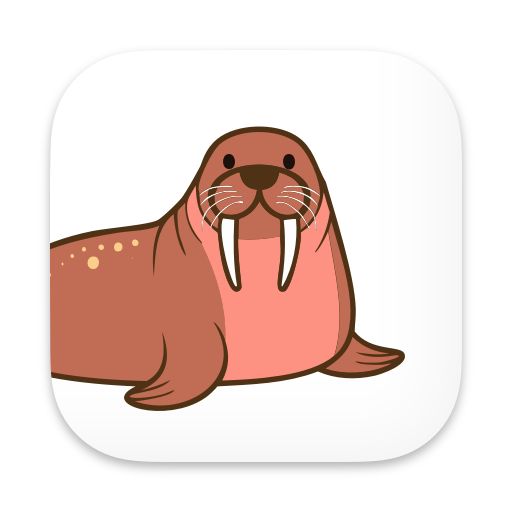

  

# 🦭 oscar

Oscar is a SwiftUI-based Mac app for monitoring incoming OSC data. It is able to listen to multiple ports simultaneously 
and sort the incoming messages into channels. Floating-point data will also be visually displayed in a chart.

You can download it [here](https://klinke-studio-public.s3.eu-west-1.amazonaws.com/apps/oscar/oscar-1.0.dmg). Updates 
will be handled automatically from within the app.

## LICENSE

This project is free to use and licensed under MIT (see [License.md](LICENSE.md))
